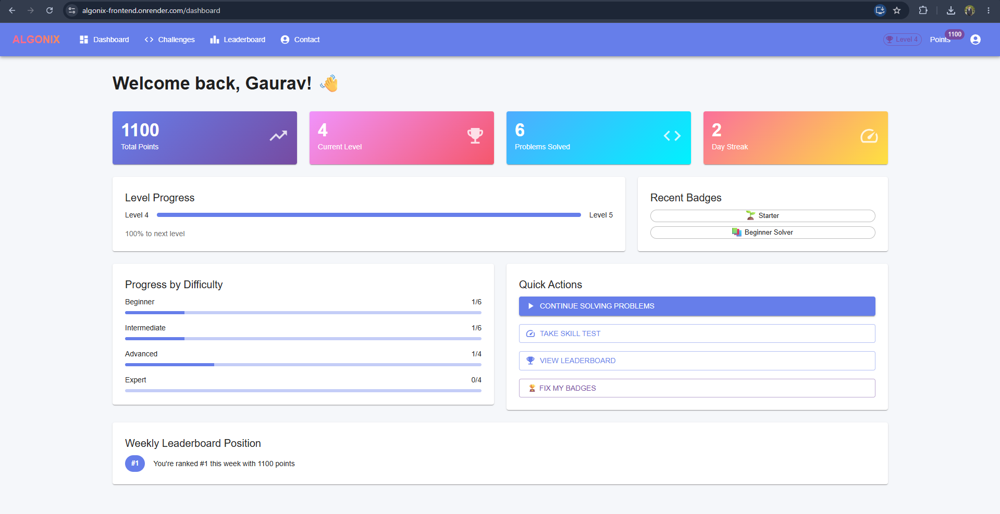
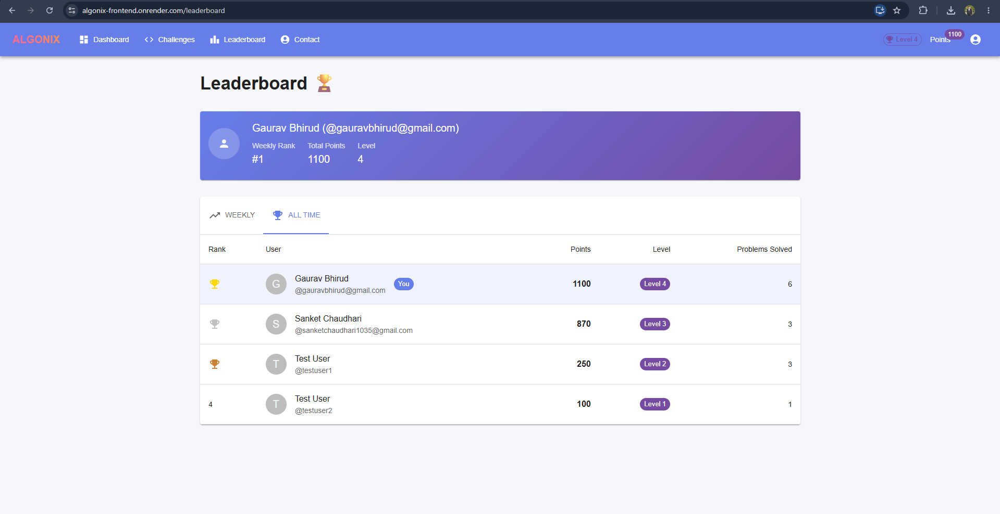
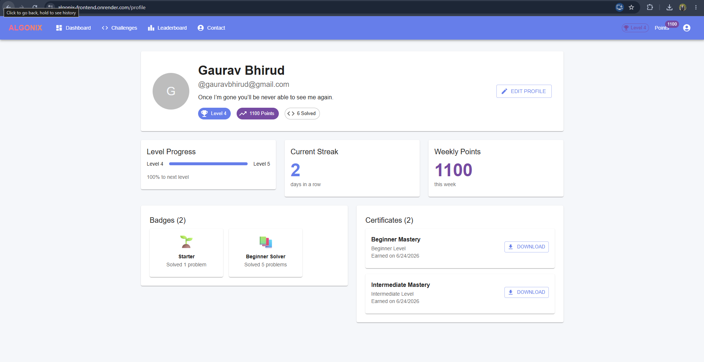
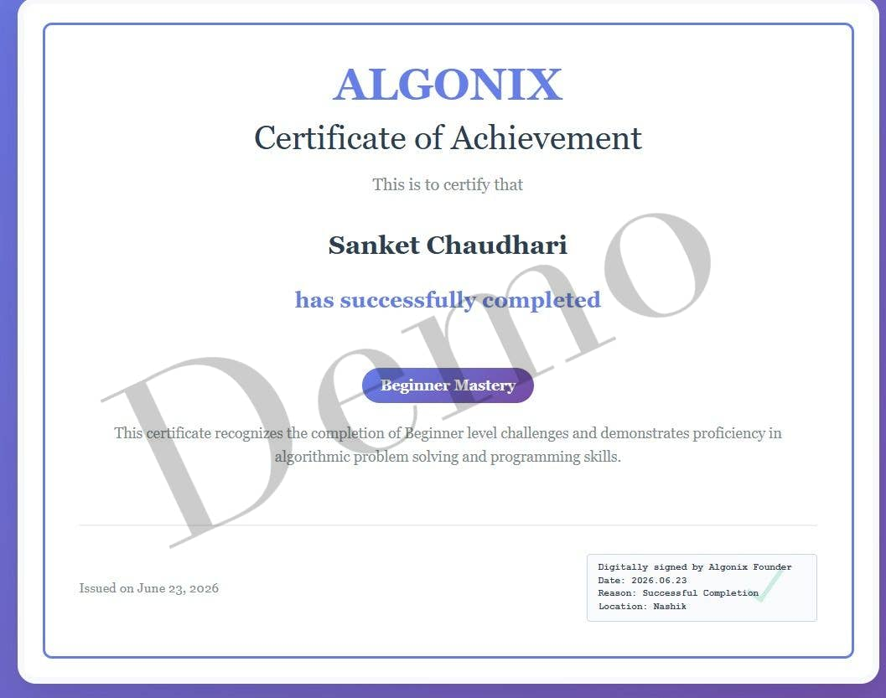

<div align="center">

# ALGONIX

### Gamified Inter-College Competitive Coding Platform

[](https://algonix-frontend.onrender.com)
[](https://reactjs.org/)
[](https://nodejs.org/)
[](https://www.mongodb.com/)
[](https://www.docker.com/)
[](https://www.typescriptlang.org/)
[](LICENSE)

> A full-stack competitive coding platform with XP-based leveling, real-time leaderboards, certificate generation, and secure container-native code execution.

</div>

---

## Screenshots

| Dashboard | Leaderboard |
|-----------|-------------|
|  |  |

| Profile & Badges | Certificate of Achievement |
|-----------------|---------------------------|
|  |  |

---

## Features

- **Coding Challenges** — Multi-difficulty (Beginner to Expert) with progressive unlocking
- **Skill Tests** — MCQ-based fast-track unlocking by difficulty level
- **Code Editor** — Monaco Editor with multi-language support (JS, Python, Java, C++)
- **LeetCode-Style Submissions** — Standard class/function-based solutions auto-wrapped with test runners
- **Performance Profiling** — Microsecond-accurate runtimes (ms) and memory footprints (MB) per submission
- **Submission Rate-Limiting** — Anti-spam throttle of 1 request per 5 seconds
- **Anti-Plagiarism Engine** — AST analysis (Python) and token-regex normalization (JS, C++, Java)
- **Gamification** — Points, levels, badges, streaks, and certificates
- **Leaderboards** — Weekly and all-time rankings
- **Admin Panel** — Manage challenges, users, and platform stats

---

## Tech Stack

| Layer | Technology |
|-------|-----------|
| Frontend | React 18, TypeScript, Material-UI, TanStack Query, Monaco Editor |
| Backend | Node.js, Express.js, MongoDB/Mongoose, JWT |
| Code Execution | Container-Native (Node, Python 3, G++, JDK 17) |
| DevOps | Docker, Docker Compose, Nginx |
| Deployment | Render |

---

## Code Execution Architecture

Algonix uses container-native execution — no external APIs or third-party judges.

- **No External Dependencies** — Removed all reliance on Glot, Piston, or Judge0
- **Deployment-Isolated** — Containers pre-installed with python3, g++, and openjdk17
- **Local Fallback** — Dev mode runs using local native runtimes, zero Docker config needed

---

## Advanced Features

- **Performance Profiling** — Uses `process.hrtime.bigint()` for microsecond execution timing and custom memory baseline heuristics
- **Rate Limiting** — Express middleware throttle (1 req/5s) + Nginx limits (10 req/s API, 5 req/min login)
- **Anti-Plagiarism** — Python AST fingerprinting + JS/C++/Java token normalization matched against MongoDB submissions
- **Digital Certificates** — Auto-issued on milestone completion (3 Beginner / 5 Intermediate / 10 Advanced), printable via browser-native `window.print()` with Adobe-style verification seal

---

## Running Locally

### Option 1 — Without Docker (Quickest)

**Prerequisites:** Node.js 18+, Python 3, G++, JDK 17

```bash
# Clone and install
git clone https://github.com/sanket1035/algonix.git
cd algonix
npm run install-all

# Configure environment
cp backend/.env.example backend/.env
# Edit backend/.env with your MongoDB URI and JWT secret

# Start both servers
npm run dev
```

Frontend runs on `http://localhost:3000`, Backend on `http://localhost:5000`

---

### Option 2 — With Docker (Full Stack, No manual installs)

**Prerequisites:** Docker + Docker Compose

```bash
git clone https://github.com/sanket1035/algonix.git
cd algonix

# Copy and configure env
cp backend/.env.example backend/.env
# Edit backend/.env — set MONGODB_URI to your Atlas URI or use local mongo

# Build and run all services
docker-compose up --build
```

App available at `http://localhost:3000`

To stop:
```bash
docker-compose down
```

---

### Environment Variables

```env
PORT=5000
MONGODB_URI=mongodb://localhost:27017/algonix
JWT_SECRET=your_strong_secret
NODE_ENV=development
FRONTEND_URL=http://localhost:3000
```

---

## API Endpoints

| Method | Endpoint | Description |
|--------|----------|-------------|
| POST | `/api/auth/register` | Register user |
| POST | `/api/auth/login` | Login |
| GET | `/api/auth/me` | Get current user |
| PUT | `/api/auth/profile` | Update profile |
| GET | `/api/challenges` | List challenges |
| GET | `/api/challenges/:id` | Get challenge |
| POST | `/api/challenges/skill-test` | Get skill test questions |
| POST | `/api/challenges/skill-test/submit` | Submit skill test |
| POST | `/api/submissions` | Submit solution |
| GET | `/api/submissions/my-submissions` | User submissions |
| GET | `/api/leaderboard/weekly` | Weekly leaderboard |
| GET | `/api/leaderboard/all-time` | All-time leaderboard |

---

## Project Structure

```
algonix/
├── frontend/             # React + TypeScript
│   └── src/
│       ├── components/   # Reusable UI components
│       ├── pages/        # Dashboard, Challenges, Leaderboard, Profile
│       └── utils/        # API helpers, auth
├── backend/              # Node.js + Express
│   ├── routes/           # API route handlers
│   ├── models/           # Mongoose schemas
│   ├── middleware/        # JWT auth, rate limiting
│   └── execution/        # Container-native code runner
├── Dockerfile
├── docker-compose.yml
├── nginx.conf
├── render.yaml
└── DEPLOYMENT.md
```

---

## Deployment

See [DEPLOYMENT.md](./DEPLOYMENT.md) for full cloud deployment instructions.

**Live:** [https://algonix-frontend.onrender.com](https://algonix-frontend.onrender.com)

---

## Security

- JWT authentication with 7-day expiry
- bcrypt password hashing
- Submission rate-limiting (1 req/5s per user)
- Nginx rate limiting (10 req/s API, 5 req/min login)
- CORS restricted to configured origins

---

## License

MIT © [Sanket Chaudhari](https://github.com/sanket1035)
